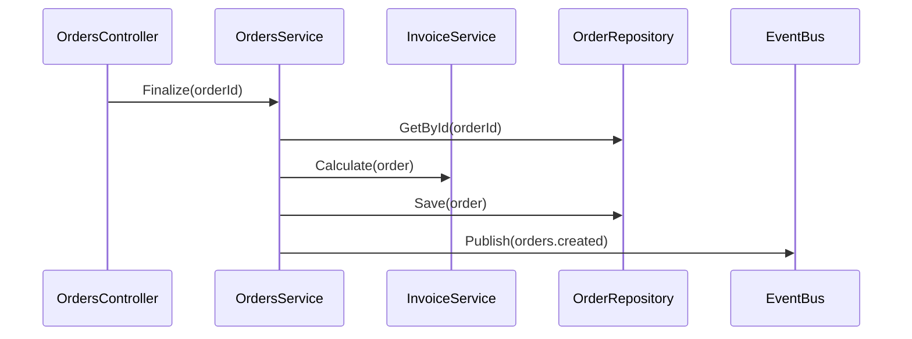
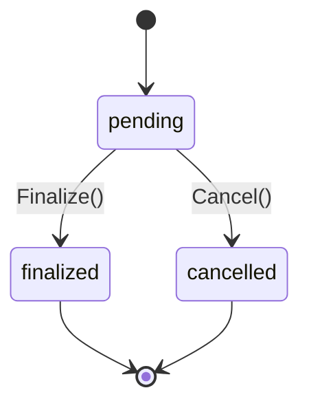

# Template — `<unit>/design.md`

## Structure

```markdown
# Design — <unit name>

## Architecture

[1-2 paragraphs: how this unit fits in the larger system. Reference the C4 diagrams.]

## Components

| Component | Type | Path | Confidence |
|-----------|------|------|------------|
| OrdersController | Controller | src/controllers/OrdersController.cs | 🟢 |
| OrdersService | Service | src/services/OrdersService.cs | 🟢 |
| OrderRepository | Repository | src/repositories/OrderRepository.cs | 🟢 |

## Internal flows

[Document flows that are NOT externally observable. These are implementation detail; they don't need ATDD scenarios.]

### Flow: Order finalization (internal)
1. OrdersService.Finalize is called with an OrderId
2. Service loads the order via OrderRepository.GetById
3. Service calls InvoiceService.Calculate
4. Service emits the orders.created event
5. Repository persists the new state

Mermaid:


## Private API coverage note

- `POST /internal/sync/orders` (private endpoint, no @api scenario): covered transitively by `@browser` scenario "Submit order through UI" — UI flow triggers internal sync as a side effect. Cite: `OrderForm.tsx:115` calls `/internal/sync/orders`.

## Data structures

```typescript
interface Order {
  id: string;
  customerId: string;
  items: OrderItem[];
  status: 'pending' | 'finalized' | 'cancelled';
  subtotal: number;
  total: number;
}
```

Confidence: 🟢 (cited from `models/Order.ts:1`)

## State machine (when applicable)



## Database interactions (when applicable)

**App-owned tables**: `orders`, `order_items` — read/write.

**External-DB calls** (when database_ownership = external or mixed):
- `EXEC dbo.usp_CalculateInvoiceTotal @OrderId, @Subtotal` — called from `InvoiceService.cs:142`. Frozen contract; covered by @database scenario in requirements.md.

## Dependencies

- `users` module — for customer lookup
- `payments` module — for charge processing
- External: Stripe SDK, RabbitMQ producer
```

## Notes

- `design.md` documents how it works. `requirements.md` documents what it does. `tasks.md` documents what to build (or rebuild).
- Internal flows don't need scenarios — they're implementation detail.
- Always cite file:line for design claims.
- Use Mermaid for sequence diagrams and state machines.
